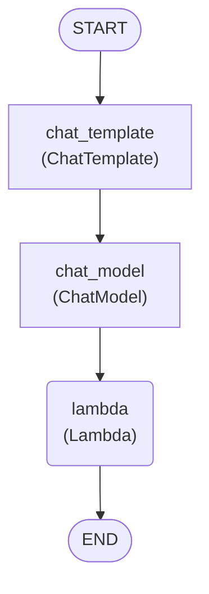
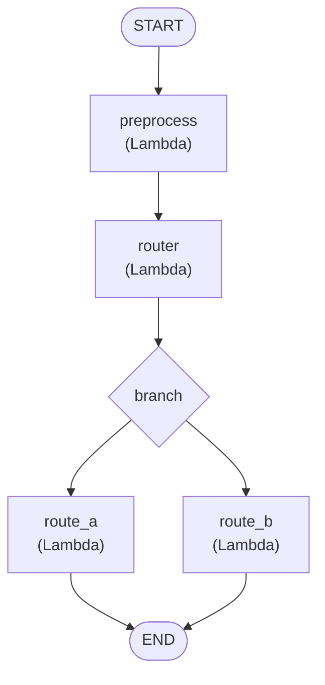
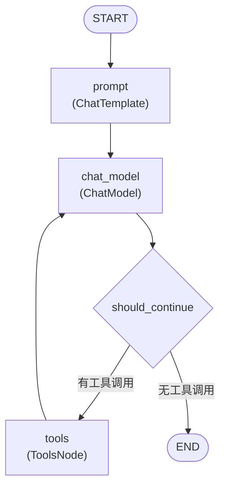
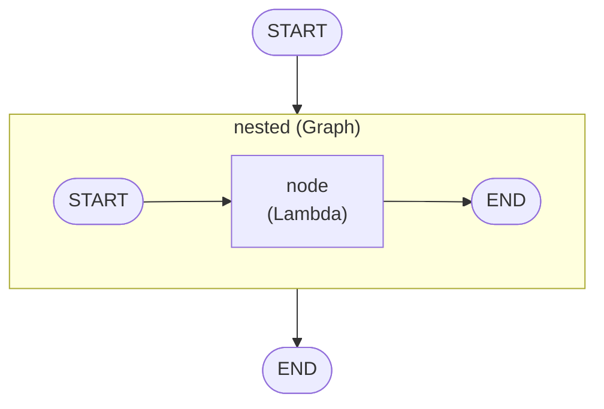

# Eino 可视化工具

将 Graph/Chain/Workflow 渲染为 Mermaid 图表，帮助开发者理解编排结构。

## 概述

Eino 提供了 `devops/visualize` 包，可以将编译后的 Graph 结构转换为 Mermaid 图表：

- 自动识别节点类型（ChatModel、ToolsNode、Lambda 等）
- 支持嵌套 SubGraph 渲染
- 区分控制流和数据流
- 支持分支决策节点

## 安装

```bash
# 可视化工具在 eino-examples 仓库中
# 如果需要生成图片，安装 mermaid-cli
npm install -g @mermaid-js/mermaid-cli
```

## 基本使用

### 1. 创建可视化生成器

```go
import "github.com/cloudwego/eino-examples/devops/visualize"

// 创建生成器，指定输出目录
gen := visualize.NewMermaidGenerator("./output")
```

### 2. 编译时注入回调

```go
import "github.com/cloudwego/eino/compose"

// 编译 Graph 时注入可视化回调
compiled, err := graph.Compile(ctx,
    compose.WithGraphCompileCallbacks(gen),
    compose.WithGraphName("my_graph"),
)
```

### 3. 输出文件

编译完成后会自动生成：
- `my_graph.md` - Markdown 文件（包含 Mermaid 代码块）
- `my_graph.png` - PNG 图片（如果安装了 mermaid-cli）

## 输出格式

### 节点类型

| 组件类型 | 形状 | 示例 |
|----------|------|------|
| 普通节点 | 方框 `[ ]` | `[chat_model<br/>(ChatModel)]` |
| Lambda | 圆角 `( )` | `(my_lambda<br/>(Lambda))` |
| START/END | 圆形 `(( ))` | `((START))` |
| 分支决策 | 菱形 `{ }` | `{branch}` |
| SubGraph | 子图 | `subgraph node_id [...]` |

### 边类型

Workflow 模式下会区分边类型：

| 类型 | 语法 | 说明 |
|------|------|------|
| control+data | `A --> B` | 控制流和数据流同时存在 |
| control-only | `A ==> B` | 仅控制流（加粗箭头） |
| data-only | `A -.-> B` | 仅数据流（虚线箭头） |

## 示例

### Chain 可视化

```go
chain := compose.NewChain[map[string]any, *schema.Message]().
    AppendChatTemplate(prompt).
    AppendChatModel(model).
    AppendLambda(lambda).
    Compile(ctx,
        compose.WithGraphCompileCallbacks(gen),
        compose.WithGraphName("chain_example"),
    )
```

输出：



### Graph 带分支可视化

```go
graph := compose.NewGraph[map[string]any, *schema.Message]()

graph.AddLambdaNode("preprocess", lambda1)
graph.AddLambdaNode("router", lambda2)
graph.AddLambdaNode("route_a", lambda3)
graph.AddLambdaNode("route_b", lambda4)

graph.AddEdge(compose.START, "preprocess")
graph.AddEdge("preprocess", "router")
graph.AddBranch("router", branch)
graph.AddEdge("route_a", compose.END)
graph.AddEdge("route_b", compose.END)

compiled, _ := graph.Compile(ctx,
    compose.WithGraphCompileCallbacks(gen),
    compose.WithGraphName("branch_example"),
)
```

输出：



### ReAct Agent 可视化

```go
agent, _ := react.NewAgent(ctx, &react.AgentConfig{
    ToolCallingModel: model,
    ToolsConfig: compose.ToolsNodeConfig{
        Tools: []tool.BaseTool{weatherTool},
    },
})

// ReAct Agent 内部是一个带循环的 Graph
compiled, _ := agent.Compile(ctx,
    compose.WithGraphCompileCallbacks(gen),
    compose.WithGraphName("react_agent"),
)
```

输出（简化版）：



### SubGraph 可视化

```go
// 创建嵌套的 Graph
innerGraph := compose.NewGraph[Input, Output]()
// ... 添加节点 ...

outerGraph := compose.NewGraph[Input, Output]()
outerGraph.AddGraph("nested", innerGraph)

compiled, _ := outerGraph.Compile(ctx,
    compose.WithGraphCompileCallbacks(gen),
    compose.WithGraphName("nested_example"),
)
```

输出：



## 高级用法

### 自定义输出

```go
import "bytes"

// 写入自定义 Writer
buf := &bytes.Buffer{}
gen := visualize.NewMermaidGenerator(buf)

// 编译后手动处理输出
compiled, _ := graph.Compile(ctx,
    compose.WithGraphCompileCallbacks(gen),
)

mermaidCode := buf.String()
// 自定义处理...
```

### 集成到 CI/CD

```bash
#!/bin/bash
# generate_diagrams.sh

# 运行可视化生成
go run ./cmd/visualize/

# 检查生成的图表
if [ -f "output/my_graph.md" ]; then
    echo "Graph visualization generated successfully"
fi
```

## 在 Markdown 中渲染

生成的 Mermaid 代码可以直接在支持的 Markdown 渲染器中显示：

1. **GitHub** - 原生支持 Mermaid
2. **GitLab** - 原生支持 Mermaid
3. **Typora** - 需要开启 Mermaid 支持
4. **VS Code** - 安装 Markdown Preview Mermaid Support 插件
5. **Notion** - 使用 Mermaid 代码块

## 调试技巧

### 查看实际 Graph 结构

```go
// 编译后获取 GraphInfo
compiled, _ := graph.Compile(ctx)

// GraphInfo 包含所有节点和边的信息
// 可视化工具基于此信息生成图表
```

### 理解循环结构

ReAct Agent 等带循环的结构在可视化中体现为：
- `model` -> `should_continue` -> `tools` -> `model`
- 形成闭环

### 检查分支条件

分支节点（`{branch}`）显示决策点：
- 输入来自条件判断节点
- 输出指向可能的分支目标

## 相关链接

- [Mermaid 官方文档](https://mermaid.js.org/)
- [Mermaid CLI](https://github.com/mermaid-js/mermaid-cli)
- [Eino Examples - visualize](https://github.com/cloudwego/eino-examples/tree/main/devops/visualize)